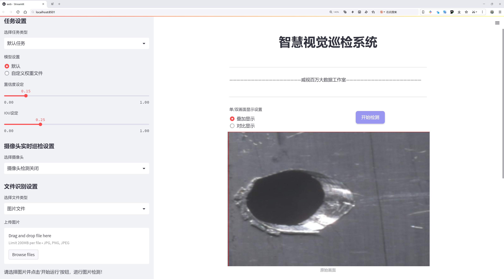
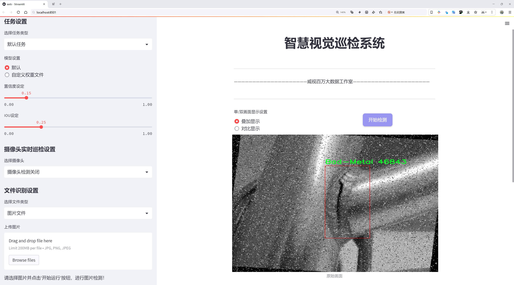
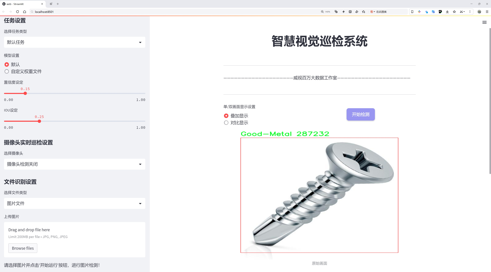
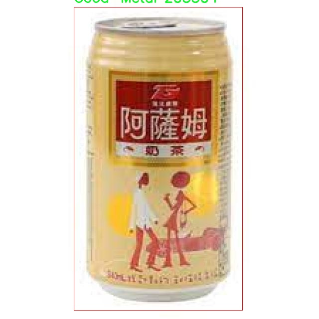

# 金属品质检测检测系统源码分享
 # [一条龙教学YOLOV8标注好的数据集一键训练_70+全套改进创新点发刊_Web前端展示]

### 1.研究背景与意义

项目参考[AAAI Association for the Advancement of Artificial Intelligence](https://gitee.com/qunmasj/projects)

项目来源[AACV Association for the Advancement of Computer Vision](https://github.com/qunshansj/good)

研究背景与意义

随着工业化进程的加快，金属材料在各个领域的应用愈加广泛，尤其是在制造业、建筑业和交通运输等行业。金属的品质直接影响到产品的安全性、耐用性和经济性，因此，确保金属材料的质量成为了行业内的重要课题。传统的金属品质检测方法多依赖人工检查和简单的物理测试，这不仅耗时耗力，而且容易受到人为因素的影响，导致检测结果的不准确性和不一致性。随着计算机视觉和深度学习技术的迅猛发展，基于图像处理的自动化检测系统逐渐成为解决这一问题的有效手段。

YOLO（You Only Look Once）系列模型因其高效的实时目标检测能力而受到广泛关注。YOLOv8作为该系列的最新版本，进一步提升了检测精度和速度，适用于多种复杂场景下的目标识别任务。在金属品质检测中，YOLOv8能够快速识别和分类金属表面的缺陷，如划痕、凹陷和锈蚀等，从而实现对金属材料的高效监控和质量控制。本研究旨在基于改进的YOLOv8模型，构建一个高效的金属品质检测系统，以提高金属材料的检测效率和准确性。

本研究所使用的数据集包含3714张图像，分为“Bad-Metal”和“Good-Metal”两个类别。这一数据集的构建不仅为模型的训练提供了丰富的样本，还为后续的模型评估和优化奠定了基础。通过对不同类别金属的图像进行分析，研究者可以深入理解金属表面缺陷的特征，进而优化YOLOv8模型的参数设置，提高其在实际应用中的表现。此外，数据集的多样性和丰富性使得模型能够在不同的光照、角度和背景下进行训练，从而增强其鲁棒性和适应性。

在工业4.0背景下，智能制造和自动化检测成为了未来发展的重要趋势。基于改进YOLOv8的金属品质检测系统不仅能够提高检测效率，降低人工成本，还能实现对金属材料质量的实时监控，为企业的生产管理提供数据支持。通过引入深度学习技术，企业能够在生产过程中及时发现和纠正质量问题，减少次品率，提高产品的市场竞争力。

综上所述，本研究的意义在于通过构建基于改进YOLOv8的金属品质检测系统，推动金属材料检测技术的进步，为相关行业提供高效、准确的检测解决方案。这不仅有助于提升金属材料的整体质量水平，还为智能制造的发展提供了有力的技术支撑，具有重要的理论价值和实际应用前景。

### 2.图片演示







##### 注意：由于此博客编辑较早，上面“2.图片演示”和“3.视频演示”展示的系统图片或者视频可能为老版本，新版本在老版本的基础上升级如下：（实际效果以升级的新版本为准）

  （1）适配了YOLOV8的“目标检测”模型和“实例分割”模型，通过加载相应的权重（.pt）文件即可自适应加载模型。

  （2）支持“图片识别”、“视频识别”、“摄像头实时识别”三种识别模式。

  （3）支持“图片识别”、“视频识别”、“摄像头实时识别”三种识别结果保存导出，解决手动导出（容易卡顿出现爆内存）存在的问题，识别完自动保存结果并导出到tempDir中。

  （4）支持Web前端系统中的标题、背景图等自定义修改，后面提供修改教程。

  另外本项目提供训练的数据集和训练教程,暂不提供权重文件（best.pt）,需要您按照教程进行训练后实现图片演示和Web前端界面演示的效果。

### 3.视频演示

[3.1 视频演示](https://www.bilibili.com/video/BV1UrHaeDEpF/?vd_source=ff015de2d29cbe2a9cdbfa7064407a08)

### 4.数据集信息展示

数据集信息展示

在现代工业生产中，金属品质的检测是确保产品质量的重要环节。为此，构建一个高效的金属品质检测系统显得尤为重要。本研究所采用的数据集名为“Metal-Detection”，该数据集专门设计用于训练和改进YOLOv8模型，以实现对金属材料的精准检测与分类。数据集的类别数量为2，具体包括“Bad-Metal”和“Good-Metal”两个类别。这一分类不仅直观地反映了金属的品质状况，也为后续的机器学习模型提供了清晰的目标，便于模型在训练过程中进行学习和优化。

“Metal-Detection”数据集的构建过程经过精心设计，确保了数据的多样性和代表性。数据集中包含了大量不同类型的金属样本，涵盖了多种形状、尺寸和表面处理工艺的金属材料。这些样本的拍摄环境也经过严格控制，以模拟实际工业环境中的光照条件和背景干扰，从而提高模型在真实场景中的适应能力。每个样本都经过专业的标注，确保其类别标签的准确性，为YOLOv8模型的训练提供了坚实的基础。

在数据集的具体构成上，“Bad-Metal”类别主要包括表面存在缺陷、锈蚀、裂纹等问题的金属样本。这些样本的多样性使得模型能够学习到不同类型的缺陷特征，从而提高其对不合格金属的识别能力。而“Good-Metal”类别则包含了表面光滑、无明显缺陷的金属样本，代表了理想的金属品质。这一类别的样本同样丰富，涵盖了多种金属材料的标准状态，帮助模型学习到良好金属的特征。

在训练过程中，数据集的使用不仅限于简单的分类任务。通过对“Metal-Detection”数据集的深入分析，研究者能够提取出更为复杂的特征，从而实现更高层次的品质检测。这种特征提取不仅依赖于YOLOv8的强大检测能力，还结合了深度学习中的多层次特征融合技术，使得模型在面对复杂背景和多样化金属样本时，依然能够保持高效的检测性能。

此外，数据集的设计也考虑到了数据增强技术的应用。通过对原始样本进行旋转、缩放、裁剪等处理，进一步扩展了数据集的规模，提升了模型的泛化能力。这种数据增强不仅丰富了训练样本的多样性，还有效防止了模型的过拟合现象，确保其在实际应用中的可靠性。

综上所述，“Metal-Detection”数据集为改进YOLOv8的金属品质检测系统提供了坚实的基础。通过精心设计的样本类别和丰富的特征信息，该数据集不仅能够有效支持模型的训练，还为后续的工业应用奠定了良好的基础。随着研究的深入，期待这一数据集能够在金属品质检测领域发挥更大的作用，推动相关技术的进步与发展。




### 5.全套项目环境部署视频教程（零基础手把手教学）

[5.1 环境部署教程链接（零基础手把手教学）](https://www.ixigua.com/7404473917358506534?logTag=c807d0cbc21c0ef59de5)


[5.2 安装Python虚拟环境创建和依赖库安装视频教程链接（零基础手把手教学）](https://www.ixigua.com/7404474678003106304?logTag=1f1041108cd1f708b01a)

### 6.手把手YOLOV8训练视频教程（零基础小白有手就能学会）

[6.1 环境部署教程链接（零基础手把手教学）](https://www.ixigua.com/7404477157818401292?logTag=d31a2dfd1983c9668658)

### 7.70+种全套YOLOV8创新点代码加载调参视频教程（一键加载写好的改进模型的配置文件）

[7.1 环境部署教程链接（零基础手把手教学）](https://www.ixigua.com/7404478314661806627?logTag=29066f8288e3f4eea3a4)

### 8.70+种全套YOLOV8创新点原理讲解（非科班也可以轻松写刊发刊，V10版本正在科研待更新）

由于篇幅限制，每个创新点的具体原理讲解就不一一展开，具体见下列网址中的创新点对应子项目的技术原理博客网址【Blog】：


[8.1 70+种全套YOLOV8创新点原理讲解链接](https://gitee.com/qunmasj/good)

### 9.系统功能展示（检测对象为举例，实际内容以本项目数据集为准）

图9.1.系统支持检测结果表格显示

  图9.2.系统支持置信度和IOU阈值手动调节

  图9.3.系统支持自定义加载权重文件best.pt(需要你通过步骤5中训练获得)

  图9.4.系统支持摄像头实时识别

  图9.5.系统支持图片识别

  图9.6.系统支持视频识别

  图9.7.系统支持识别结果文件自动保存

  图9.8.系统支持Excel导出检测结果数据


### 10.原始YOLOV8算法原理

原始YOLOv8算法原理

YOLOv8算法是由Ultralytics团队在YOLOv5的基础上发展而来的最新目标检测模型，旨在进一步提升目标检测的准确性和效率。该算法于2023年1月发布，结合了过去两年内在目标检测领域积累的多项创新与改进。YOLOv8的设计理念延续了YOLO系列的核心思想，采用了端到端的检测框架，能够在实时性和准确性之间找到良好的平衡。

在数据预处理方面，YOLOv8延续了YOLOv5的策略，采用了多种数据增强技术，包括马赛克增强、混合增强、空间扰动和颜色扰动等。这些增强手段旨在提高模型的鲁棒性和泛化能力。然而，YOLOv8在训练的最后10个epoch中停止使用马赛克增强，以避免对数据真实分布的干扰，确保模型学习到更有价值的信息。

YOLOv8的网络结构主要由主干网络、颈部网络和头部网络组成。主干网络的核心是C2f模块，该模块是对YOLOv5中C3模块的改进。C2f模块引入了YOLOv7中的ELAN思想，增加了更多的跳层连接，这不仅丰富了梯度流信息，还有效地减轻了模型的复杂性。通过这种设计，YOLOv8能够在保持检测精度的同时，实现更轻量化的结构。此外，YOLOv8依然保留了SPPF模块，这一模块在不影响性能的前提下，显著减少了执行时间。

在颈部网络中，YOLOv8同样将所有的C3模块替换为C2f模块，并删除了两处上采样之前的卷积连接层。这一改动进一步简化了网络结构，提升了特征融合的效率。YOLOv8采用了特征金字塔网络（FPN）和路径聚合网络（PAN）的结合，确保多尺度信息之间的充分融合，从而提高对不同尺寸目标的检测能力。

头部网络的设计是YOLOv8的一大亮点。YOLOv8采用了解耦头的结构，分为两个并行的分支，分别用于提取类别特征和位置特征。这种解耦设计使得分类任务和定位任务能够独立优化，显著提高了模型的收敛速度和预测精度。分类任务更注重于特征图中提取到的特征与已有类别的相似性，而定位任务则关注边界框与真实框之间的关系。通过这种方式，YOLOv8在保持高效推理速度的同时，提升了检测精度。

YOLOv8还引入了无锚框结构，直接预测目标的中心点，并采用任务对齐学习（Task Alignment Learning，TAL）来区分正负样本。该方法通过引入分类分数和IOU的高次幂乘积作为衡量任务对齐程度的指标，确保在分类和定位损失函数中同时优化这两个任务的性能。这种创新的损失函数设计使得YOLOv8在处理复杂场景时表现出色。

在标签分配策略方面，YOLOv8摒弃了依赖于数据集的候选框聚类方法，采用了动态标签分配策略。这一策略能够根据目标的实际情况动态调整正负样本的匹配，避免了静态匹配可能带来的误差。YOLOv8的分类损失采用了变焦损失（Varifocal Loss），而回归损失则结合了CIoU损失和DFL损失。这种多元化的损失函数设计使得模型在训练过程中能够更好地关注高质量的正样本，同时降低负样本对整体损失的影响。

在实际检测性能方面，YOLOv8在COCO数据集上的表现相较于其他YOLO系列模型有了显著提升。通过对比不同尺寸模型的mAP（平均精度均值），YOLOv8在参数量没有显著增加的情况下，取得了更高的检测精度。此外，YOLOv8在推理速度上也表现优异，能够满足实时检测的需求。

综合来看，YOLOv8在结构设计、损失函数、标签分配等多个方面进行了创新与优化，使其在目标检测任务中展现出更强的能力。尤其是在实时性和准确性之间的平衡，使得YOLOv8在各种应用场景中具有广泛的适用性。随着YOLOv8的推出，目标检测技术又向前迈进了一步，为未来的研究和应用提供了更为强大的工具。


### 11.项目核心源码讲解（再也不用担心看不懂代码逻辑）

#### 11.1 ultralytics\utils\__init__.py

以下是对代码的核心部分进行提炼和详细注释的结果：

```python
import os
import platform
import subprocess
import threading
from pathlib import Path
import yaml
import logging

# 设置日志记录
def set_logging(name="ultralytics", verbose=True):
    """设置日志记录，支持UTF-8编码。"""
    level = logging.INFO if verbose else logging.ERROR  # 根据是否verbose设置日志级别
    formatter = logging.Formatter("%(message)s")  # 日志格式
    stream_handler = logging.StreamHandler()  # 创建流处理器
    stream_handler.setFormatter(formatter)  # 设置格式
    stream_handler.setLevel(level)  # 设置级别

    logger = logging.getLogger(name)  # 获取日志记录器
    logger.setLevel(level)  # 设置日志记录器级别
    logger.addHandler(stream_handler)  # 添加处理器
    logger.propagate = False  # 禁止传播
    return logger

# 设置全局日志记录器
LOGGER = set_logging(verbose=True)

# 检查当前操作系统是否为Ubuntu
def is_ubuntu() -> bool:
    """检查操作系统是否为Ubuntu。"""
    try:
        with open("/etc/os-release") as f:
            return "ID=ubuntu" in f.read()
    except FileNotFoundError:
        return False

# 检查当前是否在Docker容器中运行
def is_docker() -> bool:
    """检查脚本是否在Docker容器中运行。"""
    return Path("/proc/self/cgroup").exists() and "docker" in Path("/proc/self/cgroup").read_text()

# YAML文件的保存和加载
def yaml_save(file="data.yaml", data=None):
    """将数据保存为YAML格式的文件。"""
    file = Path(file)
    if data is None:
        data = {}
    with open(file, "w", encoding="utf-8") as f:
        yaml.safe_dump(data, f, sort_keys=False, allow_unicode=True)

def yaml_load(file="data.yaml"):
    """从YAML文件加载数据。"""
    with open(file, encoding="utf-8") as f:
        return yaml.safe_load(f) or {}

# 设置用户配置目录
def get_user_config_dir(sub_dir="Ultralytics"):
    """获取用户配置目录。"""
    if platform.system() == "Windows":
        path = Path.home() / "AppData" / "Roaming" / sub_dir
    elif platform.system() == "Darwin":  # macOS
        path = Path.home() / "Library" / "Application Support" / sub_dir
    else:  # Linux
        path = Path.home() / ".config" / sub_dir

    path.mkdir(parents=True, exist_ok=True)  # 创建目录
    return path

USER_CONFIG_DIR = get_user_config_dir()  # 获取用户配置目录
SETTINGS_YAML = USER_CONFIG_DIR / "settings.yaml"  # 设置YAML文件路径

# 设置默认配置
DEFAULT_CFG_PATH = Path(__file__).resolve().parents[1] / "cfg/default.yaml"  # 默认配置文件路径
DEFAULT_CFG_DICT = yaml_load(DEFAULT_CFG_PATH)  # 加载默认配置
DEFAULT_CFG = {k: v for k, v in DEFAULT_CFG_DICT.items()}  # 转换为字典

# 线程安全的装饰器
class ThreadingLocked:
    """确保函数的线程安全执行的装饰器类。"""
    def __init__(self):
        self.lock = threading.Lock()  # 创建锁对象

    def __call__(self, f):
        """装饰器方法，确保线程安全。"""
        def decorated(*args, **kwargs):
            with self.lock:  # 使用锁
                return f(*args, **kwargs)
        return decorated

# 检查网络连接
def is_online() -> bool:
    """检查是否有网络连接。"""
    import socket
    for host in ["1.1.1.1", "8.8.8.8"]:  # 检查多个DNS
        try:
            socket.create_connection((host, 53), timeout=2).close()
            return True
        except Exception:
            continue
    return False

ONLINE = is_online()  # 检查网络状态

# 运行时的初始化设置
SETTINGS = yaml_load(SETTINGS_YAML)  # 加载用户设置
```

### 代码核心部分的解释
1. **日志记录**：`set_logging`函数用于设置日志记录，支持UTF-8编码，方便调试和信息输出。
2. **操作系统检查**：`is_ubuntu`和`is_docker`函数用于检查当前运行环境，帮助确定程序的运行条件。
3. **YAML文件处理**：`yaml_save`和`yaml_load`函数用于将数据保存为YAML格式或从YAML文件加载数据，便于配置管理。
4. **用户配置目录**：`get_user_config_dir`函数用于获取用户的配置目录，确保程序可以在合适的位置存储配置文件。
5. **线程安全**：`ThreadingLocked`类是一个装饰器，用于确保被装饰的函数在多线程环境中安全执行。
6. **网络检查**：`is_online`函数用于检查当前的网络连接状态，以确保程序在需要网络的情况下能够正常运行。
7. **初始化设置**：在最后部分，加载用户设置和默认配置，确保程序启动时具备必要的配置。

这个文件是Ultralytics YOLO项目中的一个初始化模块，主要用于设置和管理一些工具函数、常量、类和配置。文件开头引入了多个标准库和第三方库，包括`os`、`platform`、`torch`等，提供了与操作系统、日志记录、数据处理和深度学习相关的功能。

首先，文件定义了一些常量，例如多GPU训练的环境变量`RANK`和`LOCAL_RANK`，以及项目的根目录、默认配置文件路径、线程数等。这些常量在后续的代码中会被频繁使用。

接下来，文件提供了一些帮助信息，介绍了如何使用YOLOv8模型，包括安装、使用Python SDK和命令行接口的示例。这部分信息对于用户理解如何使用该库非常重要。

文件中定义了几个类，包括`TQDM`、`SimpleClass`和`IterableSimpleNamespace`。`TQDM`类是对原有`tqdm`进度条的一个封装，提供了更灵活的参数设置。`SimpleClass`类则提供了更友好的字符串表示和属性访问，方便调试和使用。`IterableSimpleNamespace`类扩展了`SimpleNamespace`，使其支持迭代功能，便于与字典和循环结合使用。

此外，文件还定义了一些用于YAML文件读写的函数，如`yaml_save`和`yaml_load`，用于保存和加载配置数据。`yaml_print`函数则用于美观地打印YAML数据。

在设置默认配置时，文件会加载默认的YAML配置文件，并将其转换为`IterableSimpleNamespace`对象，方便后续访问和使用。

文件还包含了一些检查系统环境的函数，例如`is_ubuntu`、`is_colab`、`is_kaggle`等，用于判断当前运行环境。这些函数可以帮助用户了解代码的执行环境，从而进行相应的配置或调试。

为了支持多线程，文件定义了一个`ThreadingLocked`类，用于确保被装饰的函数在多线程环境中安全执行。此外，还有一些用于处理错误和日志记录的功能，例如`set_logging`函数设置了日志记录的格式和级别。

最后，文件的底部部分会执行一些初始化操作，包括检查安装状态、设置全局变量、应用猴子补丁等。这些操作确保了库在首次使用时能够正确配置和运行。

总的来说，这个文件为Ultralytics YOLO项目提供了必要的工具和配置管理功能，使得用户能够方便地使用和扩展该项目。

#### 11.2 ui.py

```python
import sys
import subprocess

def run_script(script_path):
    """
    使用当前 Python 环境运行指定的脚本。

    Args:
        script_path (str): 要运行的脚本路径

    Returns:
        None
    """
    # 获取当前 Python 解释器的路径
    python_path = sys.executable

    # 构建运行命令，使用 streamlit 运行指定的脚本
    command = f'"{python_path}" -m streamlit run "{script_path}"'

    # 执行命令
    result = subprocess.run(command, shell=True)
    # 检查命令执行结果，如果返回码不为0，表示出错
    if result.returncode != 0:
        print("脚本运行出错。")

# 实例化并运行应用
if __name__ == "__main__":
    # 指定要运行的脚本路径
    script_path = "web.py"  # 这里可以直接指定脚本名

    # 运行脚本
    run_script(script_path)
```

### 代码核心部分及注释说明：

1. **导入模块**：
   - `sys`：用于获取当前 Python 解释器的路径。
   - `subprocess`：用于执行外部命令。

2. **`run_script` 函数**：
   - 该函数接收一个脚本路径作为参数，并使用当前 Python 环境运行该脚本。
   - `python_path = sys.executable`：获取当前 Python 解释器的完整路径。
   - `command`：构建一个命令字符串，用于运行 `streamlit`，格式为 `python -m streamlit run script_path`。
   - `subprocess.run(command, shell=True)`：执行构建的命令。
   - `if result.returncode != 0`：检查命令的返回码，如果不为0，表示脚本运行出错，并打印错误信息。

3. **主程序入口**：
   - `if __name__ == "__main__":`：确保只有在直接运行该脚本时才会执行以下代码。
   - `script_path = "web.py"`：指定要运行的脚本文件名。
   - `run_script(script_path)`：调用 `run_script` 函数，执行指定的脚本。

这个程序文件的主要功能是通过当前的 Python 环境来运行一个指定的脚本，具体是一个名为 `web.py` 的文件。程序首先导入了必要的模块，包括 `sys`、`os` 和 `subprocess`，以及一个自定义的路径处理模块 `abs_path`。

在 `run_script` 函数中，首先获取当前 Python 解释器的路径，这样可以确保在正确的环境中运行脚本。接着，构建一个命令字符串，该命令使用 `streamlit` 模块来运行指定的脚本。这里使用了 `subprocess.run` 方法来执行这个命令，并通过 `shell=True` 参数允许在 shell 中执行命令。

如果脚本运行过程中出现错误，`result.returncode` 将不等于 0，程序会打印出“脚本运行出错”的提示信息。这样可以帮助用户识别和处理可能出现的问题。

在文件的最后部分，使用 `if __name__ == "__main__":` 来确保只有在直接运行该文件时才会执行下面的代码。此处指定了要运行的脚本路径为 `web.py`，并调用 `run_script` 函数来执行该脚本。

总的来说，这个程序文件提供了一种简单的方式来启动一个基于 Streamlit 的 Web 应用，通过指定脚本路径来运行相应的 Python 文件。

#### 11.3 ultralytics\models\sam\modules\tiny_encoder.py

以下是经过简化和注释的核心代码部分，主要包括模型的基本结构和前向传播的实现。

```python
import torch
import torch.nn as nn
import torch.nn.functional as F

class Conv2d_BN(torch.nn.Sequential):
    """执行2D卷积并随后进行批量归一化的顺序容器。"""

    def __init__(self, in_channels, out_channels, kernel_size=1, stride=1, padding=0):
        """初始化卷积层和批量归一化层。"""
        super().__init__()
        # 添加卷积层
        self.add_module("conv", nn.Conv2d(in_channels, out_channels, kernel_size, stride, padding, bias=False))
        # 添加批量归一化层
        self.add_module("bn", nn.BatchNorm2d(out_channels))


class PatchEmbed(nn.Module):
    """将图像嵌入为补丁并投影到指定的嵌入维度。"""

    def __init__(self, in_chans, embed_dim, resolution, activation):
        """初始化补丁嵌入层。"""
        super().__init__()
        img_size = (resolution, resolution)  # 假设输入图像为正方形
        self.patches_resolution = (img_size[0] // 4, img_size[1] // 4)  # 计算补丁分辨率
        self.seq = nn.Sequential(
            Conv2d_BN(in_chans, embed_dim // 2, kernel_size=3, stride=2, padding=1),
            activation(),
            Conv2d_BN(embed_dim // 2, embed_dim, kernel_size=3, stride=2, padding=1),
        )

    def forward(self, x):
        """将输入张量通过补丁嵌入序列进行处理。"""
        return self.seq(x)


class TinyViT(nn.Module):
    """TinyViT架构，用于视觉任务。"""

    def __init__(self, img_size=224, in_chans=3, num_classes=1000, embed_dims=[96, 192, 384, 768], depths=[2, 2, 6, 2]):
        """初始化TinyViT模型。"""
        super().__init__()
        self.img_size = img_size
        self.num_classes = num_classes

        # 初始化补丁嵌入层
        self.patch_embed = PatchEmbed(in_chans=in_chans, embed_dim=embed_dims[0], resolution=img_size, activation=nn.GELU)

        # 构建层
        self.layers = nn.ModuleList()
        for i_layer in range(len(depths)):
            layer = BasicLayer(dim=embed_dims[i_layer], depth=depths[i_layer])
            self.layers.append(layer)

        # 分类头
        self.head = nn.Linear(embed_dims[-1], num_classes) if num_classes > 0 else nn.Identity()

    def forward(self, x):
        """执行前向传播。"""
        x = self.patch_embed(x)  # 将输入图像嵌入为补丁
        for layer in self.layers:
            x = layer(x)  # 通过每一层
        return self.head(x)  # 通过分类头输出结果


class BasicLayer(nn.Module):
    """基本层，包含多个TinyViT块。"""

    def __init__(self, dim, depth):
        """初始化基本层。"""
        super().__init__()
        self.blocks = nn.ModuleList([TinyViTBlock(dim) for _ in range(depth)])

    def forward(self, x):
        """通过每个块处理输入。"""
        for blk in self.blocks:
            x = blk(x)
        return x


class TinyViTBlock(nn.Module):
    """TinyViT块，应用自注意力和局部卷积。"""

    def __init__(self, dim):
        """初始化TinyViT块。"""
        super().__init__()
        self.attn = Attention(dim)  # 初始化注意力机制
        self.local_conv = Conv2d_BN(dim, dim, kernel_size=3, stride=1, padding=1)  # 局部卷积

    def forward(self, x):
        """应用注意力和局部卷积。"""
        x = self.attn(x)  # 应用注意力
        x = self.local_conv(x)  # 应用局部卷积
        return x


class Attention(nn.Module):
    """多头注意力模块。"""

    def __init__(self, dim):
        """初始化注意力模块。"""
        super().__init__()
        self.qkv = nn.Linear(dim, dim * 3)  # 线性层生成查询、键、值

    def forward(self, x):
        """执行前向传播，计算注意力。"""
        qkv = self.qkv(x)  # 计算查询、键、值
        # 进一步处理以计算注意力
        return x  # 返回处理后的结果
```

### 代码注释说明
1. **Conv2d_BN**: 该类实现了一个卷积层后接批量归一化的结构，常用于卷积神经网络中以提高训练的稳定性。
2. **PatchEmbed**: 将输入图像划分为多个补丁，并通过卷积层将其嵌入到指定的维度中。
3. **TinyViT**: 主模型类，负责初始化补丁嵌入层和多个基本层，并定义前向传播的过程。
4. **BasicLayer**: 由多个TinyViT块组成的层，负责处理输入并传递到下一层。
5. **TinyViTBlock**: 主要执行自注意力机制和局部卷积的块。
6. **Attention**: 实现多头注意力机制的模块，计算输入的注意力权重。

通过以上的简化和注释，可以更清晰地理解TinyViT模型的基本结构和工作原理。

这个文件定义了一个名为 `TinyViT` 的视觉模型架构，主要用于图像处理任务。它是基于微软的 TinyViT 模型，灵感来源于 LeViT 和 Swin Transformer。文件中包含多个类，每个类负责模型的不同组成部分。

首先，文件导入了必要的库，包括 PyTorch 的核心模块和一些工具函数。接着，定义了多个类来构建模型的各个组件。

`Conv2d_BN` 类是一个简单的序列容器，包含一个二维卷积层和一个批量归一化层。它用于构建模型中的卷积操作。

`PatchEmbed` 类负责将输入图像分割成小块（patches），并将这些小块映射到指定的嵌入维度。它使用两个卷积层来实现这一过程。

`MBConv` 类实现了移动反向瓶颈卷积层，这是 EfficientNet 架构的一部分。它通过一系列卷积和激活操作来处理输入，并使用跳跃连接来增强特征传递。

`PatchMerging` 类用于合并相邻的小块特征图，并将其投影到新的维度。它通过卷积层来实现这一功能。

`ConvLayer` 类包含多个 MBConv 层，并可选择性地对输出进行下采样。它还支持梯度检查点，以节省内存。

`Mlp` 类实现了多层感知机（MLP），用于处理输入特征并应用层归一化和全连接层。

`Attention` 类实现了多头注意力机制，支持空间感知，能够根据空间分辨率应用注意力偏置。它使用可训练的注意力偏置来增强模型的表现。

`TinyViTBlock` 类是 TinyViT 的基本构建块，结合了自注意力和局部卷积。它通过局部卷积来处理输入特征，并通过注意力机制进行特征增强。

`BasicLayer` 类表示 TinyViT 的一个基本层，包含多个 TinyViTBlock，并在必要时进行下采样。

`LayerNorm2d` 类实现了二维的层归一化，用于标准化输入特征。

最后，`TinyViT` 类是整个模型的核心，负责构建模型的各个层次，包括嵌入层、多个基本层和分类头。它支持多种超参数配置，如输入图像大小、嵌入维度、深度、注意力头数等。模型在初始化时会设置权重，并提供前向传播的方法。

总体来说，这个文件实现了一个高效的视觉模型架构，结合了卷积和注意力机制，适用于各种视觉任务。

#### 11.4 train.py

以下是经过简化和注释的核心代码部分：

```python
import os
import torch
import yaml
from ultralytics import YOLO  # 导入YOLO模型

# 确定使用的设备，如果有可用的GPU则使用GPU，否则使用CPU
device = "0" if torch.cuda.is_available() else "cpu"

if __name__ == '__main__':  # 确保该模块被直接运行时才执行以下代码
    # 设置工作进程数和批次大小
    workers = 1
    batch = 2

    # 指定数据集名称
    data_name = "data"
    # 获取数据集yaml文件的绝对路径
    data_path = abs_path(f'datasets/{data_name}/{data_name}.yaml', path_type='current')
    
    # 将路径转换为Unix风格
    unix_style_path = data_path.replace(os.sep, '/')

    # 获取数据集目录路径
    directory_path = os.path.dirname(unix_style_path)
    
    # 读取YAML文件
    with open(data_path, 'r') as file:
        data = yaml.load(file, Loader=yaml.FullLoader)
    
    # 如果YAML文件中有'path'项，则修改为当前目录路径
    if 'path' in data:
        data['path'] = directory_path
        # 将修改后的数据写回YAML文件
        with open(data_path, 'w') as file:
            yaml.safe_dump(data, file, sort_keys=False)

    # 加载YOLOv8模型配置
    model = YOLO(model='./ultralytics/cfg/models/v8/yolov8s.yaml', task='detect')
    
    # 开始训练模型
    results2 = model.train(
        data=data_path,  # 指定训练数据的配置文件路径
        device=device,  # 使用指定的设备进行训练
        workers=workers,  # 指定工作进程数
        imgsz=640,  # 输入图像大小
        epochs=100,  # 训练的epoch数量
        batch=batch,  # 每个批次的大小
        name='train_v8_' + data_name  # 训练任务的名称
    )
```

### 代码注释说明：
1. **导入必要的库**：导入`os`用于文件路径操作，`torch`用于深度学习，`yaml`用于读取YAML文件，`YOLO`用于加载YOLO模型。
2. **设备选择**：根据是否有可用的GPU来选择训练设备。
3. **主程序入口**：使用`if __name__ == '__main__':`确保代码仅在直接运行时执行。
4. **设置参数**：定义工作进程数和批次大小。
5. **数据集路径**：构建数据集的YAML文件路径，并转换为Unix风格路径。
6. **读取和修改YAML文件**：读取YAML文件内容，修改`path`项为当前目录路径，并将修改后的内容写回文件。
7. **加载YOLO模型**：根据指定的配置文件加载YOLOv8模型。
8. **训练模型**：调用`train`方法开始训练，传入数据路径、设备、工作进程数、图像大小、训练轮数和批次大小等参数。

该程序文件 `train.py` 是一个用于训练 YOLOv8 模型的脚本。首先，程序导入了必要的库，包括 `os`、`torch`、`yaml` 和 `ultralytics` 中的 YOLO 模型。接着，程序通过检查是否有可用的 GPU 来决定使用 CPU 还是 GPU 进行训练。

在 `if __name__ == '__main__':` 语句下，程序确保只有在直接运行该脚本时才会执行后续代码。接下来，定义了一些训练参数，包括工作进程数 `workers` 和批次大小 `batch`。数据集的名称被设置为 `"data"`，并通过 `abs_path` 函数获取该数据集的 YAML 配置文件的绝对路径。

程序随后将路径中的分隔符转换为 UNIX 风格的斜杠，并获取数据集目录的路径。接着，程序打开 YAML 文件并读取其中的数据。为了确保数据集路径的正确性，如果 YAML 文件中存在 `path` 项，程序会将其修改为当前目录路径，并将更新后的数据写回 YAML 文件。

接下来，程序加载预训练的 YOLOv8 模型，指定模型配置文件的路径。然后，调用 `model.train()` 方法开始训练模型。在训练过程中，程序指定了训练数据的配置文件路径、使用的设备、工作进程数、输入图像的大小（640x640）、训练的 epoch 数（100）以及训练任务的名称。

总体来说，该脚本的功能是设置和启动 YOLOv8 模型的训练过程，确保数据集路径的正确性，并通过指定各种参数来控制训练的行为。

#### 11.5 ultralytics\models\sam\build.py

以下是经过简化和注释的核心代码部分：

```python
import torch
from functools import partial
from ultralytics.utils.downloads import attempt_download_asset
from .modules.decoders import MaskDecoder
from .modules.encoders import ImageEncoderViT, PromptEncoder
from .modules.sam import Sam
from .modules.tiny_encoder import TinyViT
from .modules.transformer import TwoWayTransformer

def _build_sam(encoder_embed_dim, encoder_depth, encoder_num_heads, encoder_global_attn_indexes, checkpoint=None, mobile_sam=False):
    """构建指定的SAM模型架构。"""
    
    # 定义一些模型参数
    prompt_embed_dim = 256  # 提示嵌入维度
    image_size = 1024  # 输入图像大小
    vit_patch_size = 16  # ViT的补丁大小
    image_embedding_size = image_size // vit_patch_size  # 图像嵌入大小

    # 根据是否为移动SAM选择不同的图像编码器
    image_encoder = (
        TinyViT(
            img_size=image_size,
            in_chans=3,
            num_classes=1000,
            embed_dims=encoder_embed_dim,
            depths=encoder_depth,
            num_heads=encoder_num_heads,
            window_sizes=[7, 7, 14, 7],
            mlp_ratio=4.0,
            drop_rate=0.0,
            drop_path_rate=0.0,
            use_checkpoint=False,
            mbconv_expand_ratio=4.0,
            local_conv_size=3,
            layer_lr_decay=0.8,
        ) if mobile_sam else ImageEncoderViT(
            depth=encoder_depth,
            embed_dim=encoder_embed_dim,
            img_size=image_size,
            mlp_ratio=4,
            norm_layer=partial(torch.nn.LayerNorm, eps=1e-6),
            num_heads=encoder_num_heads,
            patch_size=vit_patch_size,
            qkv_bias=True,
            use_rel_pos=True,
            global_attn_indexes=encoder_global_attn_indexes,
            window_size=14,
            out_chans=prompt_embed_dim,
        )
    )

    # 创建SAM模型
    sam = Sam(
        image_encoder=image_encoder,
        prompt_encoder=PromptEncoder(
            embed_dim=prompt_embed_dim,
            image_embedding_size=(image_embedding_size, image_embedding_size),
            input_image_size=(image_size, image_size),
            mask_in_chans=16,
        ),
        mask_decoder=MaskDecoder(
            num_multimask_outputs=3,
            transformer=TwoWayTransformer(
                depth=2,
                embedding_dim=prompt_embed_dim,
                mlp_dim=2048,
                num_heads=8,
            ),
            transformer_dim=prompt_embed_dim,
            iou_head_depth=3,
            iou_head_hidden_dim=256,
        ),
        pixel_mean=[123.675, 116.28, 103.53],  # 像素均值
        pixel_std=[58.395, 57.12, 57.375],  # 像素标准差
    )

    # 如果提供了检查点，则加载模型权重
    if checkpoint is not None:
        checkpoint = attempt_download_asset(checkpoint)  # 尝试下载检查点
        with open(checkpoint, "rb") as f:
            state_dict = torch.load(f)  # 加载权重
        sam.load_state_dict(state_dict)  # 将权重加载到模型中

    sam.eval()  # 设置模型为评估模式
    return sam  # 返回构建的模型

def build_sam(ckpt="sam_b.pt"):
    """根据指定的检查点构建SAM模型。"""
    model_builder = None
    ckpt = str(ckpt)  # 将检查点转换为字符串，以支持Path类型

    # 根据检查点选择相应的模型构建函数
    for k in sam_model_map.keys():
        if ckpt.endswith(k):
            model_builder = sam_model_map.get(k)

    if not model_builder:
        raise FileNotFoundError(f"{ckpt} 不是支持的SAM模型。可用模型有: \n {sam_model_map.keys()}")

    return model_builder(ckpt)  # 返回构建的模型
```

### 代码注释说明：
1. **导入模块**：导入必要的模块和类，包括PyTorch和SAM模型的各个组件。
2. **_build_sam函数**：该函数是构建SAM模型的核心函数，根据输入参数选择合适的编码器，并构建完整的SAM模型。
3. **模型参数**：定义了模型的各种参数，包括嵌入维度、深度、头数等。
4. **图像编码器选择**：根据是否为移动版本选择不同的图像编码器（TinyViT或ImageEncoderViT）。
5. **SAM模型构建**：创建SAM模型，包括图像编码器、提示编码器和掩码解码器。
6. **检查点加载**：如果提供了检查点，尝试下载并加载模型权重。
7. **评估模式**：将模型设置为评估模式，以便进行推理。
8. **build_sam函数**：根据给定的检查点构建相应的SAM模型，支持不同大小的模型。

以上是代码的核心部分及其详细注释，帮助理解其功能和结构。

这个程序文件是用于构建“Segment Anything Model”（SAM）的模型架构，主要包括不同大小的模型构建函数以及一些辅助功能。首先，文件引入了一些必要的库和模块，包括`torch`和一些自定义的模块（如`MaskDecoder`、`ImageEncoderViT`等），这些模块是实现模型功能的基础。

文件中定义了多个构建函数，如`build_sam_vit_h`、`build_sam_vit_l`、`build_sam_vit_b`和`build_mobile_sam`，它们分别用于构建不同大小的SAM模型（大、中、小和移动版）。每个构建函数调用了一个私有函数`_build_sam`，并传入特定的参数，例如编码器的嵌入维度、深度、头数等。这些参数的设置直接影响模型的性能和计算复杂度。

`_build_sam`函数是模型构建的核心部分。它首先定义了一些常量，比如提示嵌入维度、图像大小和补丁大小。接着，根据是否构建移动版模型，选择不同的图像编码器（`TinyViT`或`ImageEncoderViT`）。然后，创建了一个SAM模型实例，其中包括图像编码器、提示编码器和掩码解码器。掩码解码器使用了一个双向变换器（`TwoWayTransformer`），负责处理多种掩码输出。

如果提供了检查点路径，程序会尝试下载并加载模型的状态字典，以便恢复模型的权重。最后，模型被设置为评估模式，准备进行推理。

文件还定义了一个字典`sams_model_map`，将模型名称映射到相应的构建函数。`build_sam`函数则是用户接口，允许用户通过指定检查点名称来构建相应的SAM模型。如果指定的检查点不在支持的模型列表中，程序会抛出一个文件未找到的异常。

总体来说，这个文件提供了一个灵活的框架，用于构建和加载不同配置的SAM模型，适用于各种图像分割任务。

#### 11.6 ultralytics\utils\callbacks\clearml.py

以下是代码中最核心的部分，并附上详细的中文注释：

```python
# 导入必要的库
from ultralytics.utils import LOGGER, SETTINGS, TESTS_RUNNING

# 尝试导入 ClearML 相关的库，并进行基本的配置检查
try:
    assert not TESTS_RUNNING  # 确保不是在运行测试
    assert SETTINGS["clearml"] is True  # 确保 ClearML 集成已启用
    import clearml
    from clearml import Task
    from clearml.binding.frameworks.pytorch_bind import PatchPyTorchModelIO
    from clearml.binding.matplotlib_bind import PatchedMatplotlib

    assert hasattr(clearml, "__version__")  # 确保 ClearML 是一个有效的包

except (ImportError, AssertionError):
    clearml = None  # 如果导入失败，则将 clearml 设置为 None

def on_pretrain_routine_start(trainer):
    """在预训练例程开始时运行；初始化并连接/记录任务到 ClearML。"""
    try:
        task = Task.current_task()  # 获取当前任务
        if task:
            # 确保自动的 PyTorch 和 Matplotlib 绑定被禁用
            PatchPyTorchModelIO.update_current_task(None)
            PatchedMatplotlib.update_current_task(None)
        else:
            # 初始化一个新的 ClearML 任务
            task = Task.init(
                project_name=trainer.args.project or "YOLOv8",  # 项目名称
                task_name=trainer.args.name,  # 任务名称
                tags=["YOLOv8"],  # 标签
                output_uri=True,
                reuse_last_task_id=False,
                auto_connect_frameworks={"pytorch": False, "matplotlib": False},  # 禁用自动连接
            )
            LOGGER.warning(
                "ClearML Initialized a new task. If you want to run remotely, "
                "please add clearml-init and connect your arguments before initializing YOLO."
            )
        task.connect(vars(trainer.args), name="General")  # 连接训练参数
    except Exception as e:
        LOGGER.warning(f"WARNING ⚠️ ClearML installed but not initialized correctly, not logging this run. {e}")

def on_train_epoch_end(trainer):
    """在 YOLO 训练的每个 epoch 结束时记录调试样本并报告当前训练进度。"""
    task = Task.current_task()  # 获取当前任务
    if task:
        # 记录调试样本
        if trainer.epoch == 1:  # 仅在第一个 epoch 记录样本
            _log_debug_samples(sorted(trainer.save_dir.glob("train_batch*.jpg")), "Mosaic")
        # 报告当前训练进度
        for k, v in trainer.label_loss_items(trainer.tloss, prefix="train").items():
            task.get_logger().report_scalar("train", k, v, iteration=trainer.epoch)  # 记录训练损失
        for k, v in trainer.lr.items():
            task.get_logger().report_scalar("lr", k, v, iteration=trainer.epoch)  # 记录学习率

def on_train_end(trainer):
    """在训练完成时记录最终模型及其名称。"""
    task = Task.current_task()  # 获取当前任务
    if task:
        # 记录最终结果，包括混淆矩阵和 PR 曲线
        files = [
            "results.png",
            "confusion_matrix.png",
            "confusion_matrix_normalized.png",
            *(f"{x}_curve.png" for x in ("F1", "PR", "P", "R")),
        ]
        files = [(trainer.save_dir / f) for f in files if (trainer.save_dir / f).exists()]  # 过滤存在的文件
        for f in files:
            _log_plot(title=f.stem, plot_path=f)  # 记录每个图像
        # 报告最终指标
        for k, v in trainer.validator.metrics.results_dict.items():
            task.get_logger().report_single_value(k, v)  # 记录指标
        # 记录最终模型
        task.update_output_model(model_path=str(trainer.best), model_name=trainer.args.name, auto_delete_file=False)

# 定义回调函数
callbacks = (
    {
        "on_pretrain_routine_start": on_pretrain_routine_start,
        "on_train_epoch_end": on_train_epoch_end,
        "on_train_end": on_train_end,
    }
    if clearml
    else {}
)
```

### 代码说明：
1. **导入和初始化**：首先导入必要的库，并检查 ClearML 是否正确安装和配置。
2. **任务管理**：在训练开始时，初始化 ClearML 任务并连接训练参数，以便记录训练过程中的各种信息。
3. **训练过程记录**：在每个 epoch 结束时，记录调试样本、训练损失和学习率等信息。
4. **训练结束记录**：在训练完成时，记录最终模型、混淆矩阵和其他指标，确保所有重要信息都被记录到 ClearML 中。
5. **回调函数**：定义了一系列回调函数，以便在训练的不同阶段执行相应的操作。

这个程序文件 `clearml.py` 是用于与 ClearML 进行集成的回调函数，主要用于在训练 YOLO 模型时记录和管理实验数据。文件开头导入了一些必要的模块和库，包括日志记录器和设置，并尝试导入 ClearML 库。如果导入失败或条件不满足，则将 `clearml` 设置为 `None`。

在文件中定义了几个主要的函数：

1. `_log_debug_samples` 函数用于将图像文件作为调试样本记录到当前的 ClearML 任务中。它接受一个文件路径列表和一个标题，遍历文件列表，检查文件是否存在，并提取批次号，然后将图像记录到 ClearML 中。

2. `_log_plot` 函数用于将图像作为绘图记录到 ClearML 的绘图部分。它读取指定路径的图像，并使用 Matplotlib 创建一个图形，然后将其记录到 ClearML 中。

3. `on_pretrain_routine_start` 函数在预训练例程开始时运行，初始化并连接到 ClearML 任务。如果当前没有任务，则创建一个新任务，并连接训练参数。它还确保 PyTorch 和 Matplotlib 的自动绑定被禁用，以便手动记录图像和模型文件。

4. `on_train_epoch_end` 函数在每个训练周期结束时运行，记录调试样本并报告当前的训练进度。如果是第一个周期，则记录调试样本，并报告标签损失和学习率。

5. `on_fit_epoch_end` 函数在每个适应周期结束时运行，报告模型信息和验证指标到日志中。

6. `on_val_end` 函数在验证结束时运行，记录验证结果，包括标签和预测。

7. `on_train_end` 函数在训练完成时运行，记录最终模型及其名称，报告最终的指标，并将最终模型更新到 ClearML 中。

最后，定义了一个 `callbacks` 字典，其中包含了这些回调函数的映射，如果 ClearML 可用，则将这些函数添加到字典中，否则字典为空。这个文件的主要目的是通过 ClearML 记录训练过程中的重要信息，以便后续分析和可视化。

### 12.系统整体结构（节选）

### 程序整体功能和架构概括

该程序是一个基于 Ultralytics YOLO（You Only Look Once）模型的深度学习框架，主要用于目标检测和图像分割任务。程序结构模块化，包含多个文件，每个文件负责特定的功能或组件。整体架构可以分为以下几个部分：

1. **模型构建与训练**：
   - 包含模型的定义、构建和训练过程，支持不同类型的模型（如 YOLO 和 SAM）。
   
2. **工具与实用程序**：
   - 提供了各种工具函数和实用程序，帮助处理数据、日志记录、回调函数等。

3. **可视化与用户界面**：
   - 提供用户界面和可视化工具，便于用户与模型进行交互。

4. **回调与实验管理**：
   - 集成了 ClearML 等工具，用于实验管理和监控训练过程。

### 文件功能整理表

| 文件路径                                           | 功能描述                                                                                       |
|---------------------------------------------------|-----------------------------------------------------------------------------------------------|
| `ultralytics/utils/__init__.py`                   | 初始化模块，定义常量、工具函数和配置，提供帮助信息和环境检查。                                       |
| `ui.py`                                           | 启动 Streamlit Web 应用，运行指定的 Python 脚本。                                               |
| `ultralytics/models/sam/modules/tiny_encoder.py` | 定义 TinyViT 模型架构及其组件，用于图像处理任务，结合卷积和注意力机制。                               |
| `train.py`                                       | 设置和启动 YOLOv8 模型的训练过程，处理数据集路径，指定训练参数。                                    |
| `ultralytics/models/sam/build.py`                | 构建 Segment Anything Model（SAM），支持不同大小的模型构建和加载。                                  |
| `ultralytics/utils/callbacks/clearml.py`        | 与 ClearML 集成的回调函数，记录训练过程中的重要信息和实验数据。                                   |
| `ultralytics/utils/loss.py`                      | 定义损失函数，用于训练过程中的损失计算。                                                         |
| `ultralytics/models/rtdetr/__init__.py`         | 初始化 RT-DETR 模型模块，可能包含模型定义和相关功能。                                             |
| `ultralytics/trackers/utils/gmc.py`             | 实现与图像跟踪相关的功能，可能包括图像匹配和跟踪算法。                                             |
| `ultralytics/data/explorer/__init__.py`         | 数据探索模块的初始化，可能用于数据集的加载和处理。                                               |

这个表格总结了每个文件的主要功能，展示了整个程序的模块化结构和功能分布。

注意：由于此博客编辑较早，上面“11.项目核心源码讲解（再也不用担心看不懂代码逻辑）”中部分代码可能会优化升级，仅供参考学习，完整“训练源码”、“Web前端界面”和“70+种创新点源码”以“13.完整训练+Web前端界面+70+种创新点源码、数据集获取”的内容为准。

### 13.完整训练+Web前端界面+70+种创新点源码、数据集获取


https://mbd.pub/o/bread/ZpqZkppt